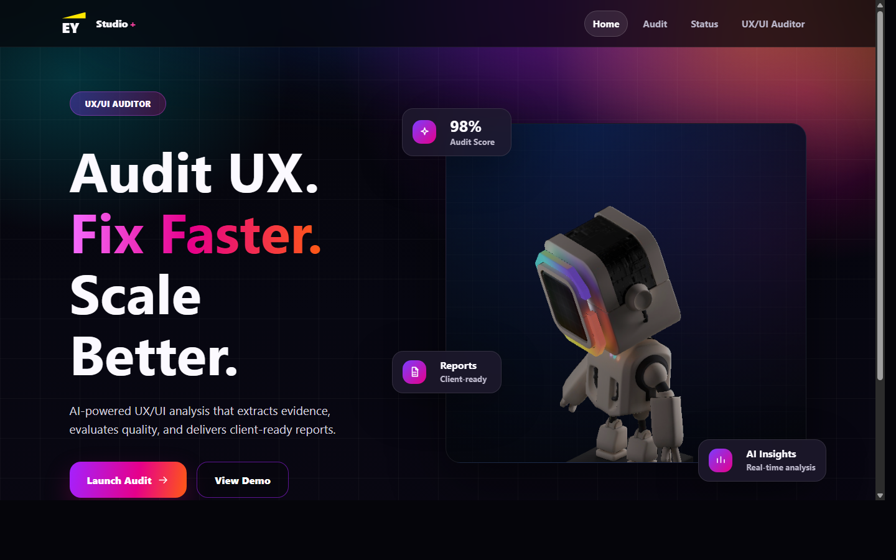
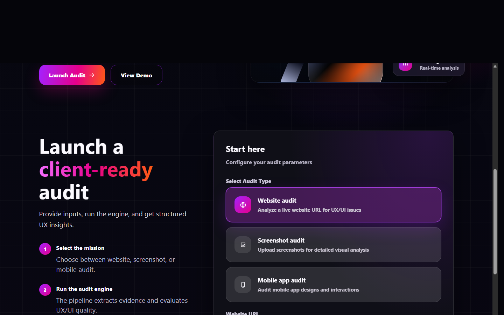

# UX/UI Auditor

UX/UI Auditor is a Python-first audit platform for reviewing websites and mobile apps through a structured UX/UI pipeline. It supports live website crawling, screenshot-based GTM review, Android extraction through Appium, workbook export, and static HTML report generation.

## Usage

Use the project through the local launcher UI or through the CLI.

### What the user can do

The current frontend flow is:

1. Choose the experience type:
   - `Website audit`
   - `Mobile app audit`
2. Choose the input method for that experience:
   - Website:
     - `Live URL`
     - `Website screenshots`
   - Mobile app:
     - `Live app session`
     - `App screenshots`
3. Run the appropriate pipeline:
   - Website live URL:
     - `Detailed audit`
     - `GTM audit`
   - Website screenshots:
     - screenshot-based GTM audit with website context
   - Mobile live app session:
     - Appium-based Android extraction
   - App screenshots:
     - screenshot-based GTM audit with mobile-app context

### Fastest way to run it

Install dependencies:

```bash
pip install -r requirements.txt
python -m playwright install chromium
```

Run the local launcher:

```bash
npm run ui
```

If PowerShell blocks `npm.ps1`:

```bash
npm.cmd run ui
```

Open:

```text
http://127.0.0.1:8787
```

### Common commands

Detailed website audit:

```bash
python scripts/run_pipeline.py https://example.com
```

GTM website audit:

```bash
python scripts/run_pipeline.py https://example.com --mode gtm
```

Screenshot GTM audit:

```bash
python -m src.gtm_audit.generate_screenshot_gtm_audit --screenshots path/to/shot-1.png path/to/shot-2.png --site-name "Client Review" --surface-type website
```

Mobile screenshot GTM audit:

```bash
python -m src.gtm_audit.generate_screenshot_gtm_audit --screenshots path/to/app-1.png path/to/app-2.png --site-name "App Review" --surface-type mobile_app
```

Mobile live extraction:

```bash
python -m src.mobile_audit.run_mobile_audit --app-package com.example.app --app-activity .MainActivity
```

## Product Screens

### Landing page



### Audit launcher workflow



## What the Project Does

The platform combines multiple audit paths under one launcher:

- Crawls websites and discovers navigable pages.
- Visits each unique page with Playwright.
- Captures screenshots and safe-interaction evidence.
- Extracts structured HTML evidence such as headings, forms, labels, media, text content, and navigation.
- Extracts rendered UI evidence such as layout, components, hierarchy, typography, interaction affordances, and consistency cues.
- Generates detailed sheet-based UX/UI checks.
- Exports checks into an Excel workbook.
- Generates a detailed static HTML report from the workbook pipeline.
- Generates a GTM-oriented 7-axis report from website evidence.
- Generates GTM reports from uploaded screenshots.
- Distinguishes website screenshots from mobile app screenshots during review.
- Connects to Appium to extract Android mobile screens, hierarchies, safe actions, and artifacts.
- Optionally packages and deploys GTM reports to Vercel.

## Functionalities

### 1. Detailed website audit

This is the full page-audit path for a live website URL.

It:

- crawls the site navigation
- audits the discovered pages
- produces cleaned extraction JSON
- generates structured checks
- writes an Excel workbook
- generates a detailed HTML report

This is the most complete audit path when you want workbook output and rule-based UX/UI checks.

### 2. GTM website audit

This starts from a live website URL too, but instead of ending in the detailed workbook/report flow, it synthesizes the website evidence into a 7-axis GTM review.

The GTM report focuses on commercial UX/UI quality through seven axes defined in [src/gtm_audit/common.py](C:/dev/UX-UI_-Agent/src/gtm_audit/common.py).

### 3. Website screenshot audit

This is a screenshot-only GTM audit for websites.

It does not crawl a live site. Instead, it:

- takes uploaded website screenshots
- runs multimodal visual review
- applies the GTM axes with website expectations
- generates a GTM JSON payload
- renders a static GTM report
- optionally deploys the report to Vercel

### 4. Mobile app screenshot audit

This uses the same screenshot GTM engine, but it is no longer treated like a website review.

It:

- takes uploaded mobile app screens
- runs the same 7-axis GTM review
- applies mobile-first assumptions in the vision prompt
- avoids judging app screens by website-only conventions
- generates a static GTM report with mobile screenshot context

### 5. Mobile live app audit

This is the Android extraction path.

It connects to Appium, launches the app, captures a baseline state, performs bounded all-safe exploration, records screen artifacts, and writes the results under `shared/generated/mobile-audits/<job-id>/`.

It is currently an extraction-first pipeline rather than a full workbook/report scoring flow.

## End-to-End Workflow

### Website live URL workflow

This is the path behind `python scripts/run_pipeline.py https://...`.

1. `navigator/crawler.py`
   - crawls the homepage and navigation
   - produces `shared/generated/website_menu.json`
2. `python -m src.main`
   - loads the crawler output
   - visits pages with Playwright
   - captures screenshots and safe interactions
   - writes:
     - `shared/output/results/audit-results_*.json`
     - `shared/generated/html_extraction.json`
     - `shared/generated/html_cleaned.json`
     - `shared/generated/rendered_ui_extraction.json`
3. `python -m src.audit.checks.run_sheet_checks`
   - converts cleaned HTML + rendered evidence into structured audit rows
   - writes `shared/generated/sheet_checks.json`
4. Detailed mode:
   - `python -m src.audit.export.write_checks_to_workbook`
   - `python -m src.report.generate_audit_report`
5. GTM mode:
   - `python -m src.gtm_audit.generate_gtm_audit`
   - `python -m src.gtm_audit.generate_gtm_report`
   - `python -m src.gtm_audit.vercel_static_deploy`

### Screenshot workflow

This path is handled through:

- [src/ui/server.py](C:/dev/UX-UI_-Agent/src/ui/server.py) for upload/job orchestration
- [src/gtm_audit/generate_screenshot_gtm_audit.py](C:/dev/UX-UI_-Agent/src/gtm_audit/generate_screenshot_gtm_audit.py) for GTM synthesis

Flow:

1. User uploads screenshots through the frontend.
2. The UI sends `surfaceType`:
   - `website`
   - `mobile_app`
3. The backend saves the uploads under:
   - `shared/generated/screenshot-audits/<job-id>/uploads/`
4. The screenshot GTM generator builds screenshot metadata and site context.
5. The vision layer reviews the screenshots with website or mobile-app assumptions.
6. A GTM JSON payload is written.
7. A static GTM report is generated.
8. The report is optionally packaged and deployed to Vercel.

### Mobile live workflow

This path is handled through:

- [src/ui/server.py](C:/dev/UX-UI_-Agent/src/ui/server.py)
- [src/mobile_audit/run_mobile_audit.py](C:/dev/UX-UI_-Agent/src/mobile_audit/run_mobile_audit.py)

Flow:

1. The user submits:
   - app package
   - app activity
   - Appium URL
   - device/emulator details
2. The backend starts the mobile job.
3. The mobile runner connects to Appium and launches the app.
4. The runner normalizes the baseline state.
5. The explorer performs bounded, safe-only exploration.
6. The artifact writer persists captures, screen metadata, and interactions.

## GTM audit model

The GTM layer uses seven axes defined in [src/gtm_audit/common.py](C:/dev/UX-UI_-Agent/src/gtm_audit/common.py).

The axes are not just labels. They now carry:

- description
- core question
- what to look for
- healthy signals
- failure modes
- out-of-scope boundaries
- severity guidance
- evidence expectations
- default remediation direction

The multimodal review path in [src/gtm_audit/vision_client.py](C:/dev/UX-UI_-Agent/src/gtm_audit/vision_client.py) uses those axis contracts and now distinguishes:

- website screenshot expectations
- mobile app screenshot expectations

The result is sharper evidence, better prioritization, and fewer findings that confuse website patterns with app patterns.

## Main Entry Points

- [src/ui/server.py](C:/dev/UX-UI_-Agent/src/ui/server.py)
  - local HTTP server
  - frontend asset server
  - audit job API
  - health endpoint
  - website, screenshot, and mobile job orchestration

- [scripts/run_pipeline.py](C:/dev/UX-UI_-Agent/scripts/run_pipeline.py)
  - main website orchestration script
  - detailed and GTM live-website entrypoint

- [src/main.py](C:/dev/UX-UI_-Agent/src/main.py)
  - website page-audit execution
  - extraction and rendered evidence generation

- [src/mobile_audit/run_mobile_audit.py](C:/dev/UX-UI_-Agent/src/mobile_audit/run_mobile_audit.py)
  - Android extraction entrypoint

- [src/gtm_audit/generate_screenshot_gtm_audit.py](C:/dev/UX-UI_-Agent/src/gtm_audit/generate_screenshot_gtm_audit.py)
  - screenshot-based GTM entrypoint

## Project Structure

```text
src/
  audit/
    checks/                 Sheet-based UX/UI checks and AI reconciliation
    export/                 Excel workbook writer
    ai_review_client.py     Shared AI client for structured review calls
    ai_review_enricher.py   Detailed audit enrichment layer
    html_extractor.py       Raw HTML extraction
    html_postprecess.py     HTML cleanup / normalization
    rendered_css_extractor.py
                            Rendered UI evidence builder
    page_runner.py          One-page Playwright audit runner
    safe_interaction_tester.py
                            Safe interaction execution and evidence capture
  config/
    audit_config.py         Central runtime configuration
  gtm_audit/
    common.py               GTM axis definitions and shared scoring helpers
    vision_client.py        Multimodal GTM review prompt + parsing
    evidence.py             Evidence bundling and spotlight selection
    generate_gtm_audit.py   Website-evidence to GTM synthesis
    generate_screenshot_gtm_audit.py
                            Screenshot-only GTM synthesis
    generate_gtm_report.py  Static GTM report generation
    vercel_static_deploy.py Vercel packaging and optional deployment
  mobile_audit/
    device_manager.py       ADB/Appium device resolution and session setup
    mobile_runner.py        Baseline capture and mobile execution helpers
    screen_explorer.py      Bounded all-safe mobile exploration
    mobile_artifact_writer.py
                            Persisted mobile artifacts
    run_mobile_audit.py     Mobile extraction entrypoint
  report/
    generate_audit_report.py
                            Detailed report site generator
    site_assets/            Detailed report frontend assets
  ui/
    server.py               Launcher API server
    static/
      index.html            Frontend UI
      config.js             Frontend runtime API base URL config
navigator/
  crawler.py                Website navigation discovery
scripts/
  run_pipeline.py           Website pipeline orchestrator
shared/
  generated/                Generated JSON, reports, screenshots, workbooks
  output/results/           Per-run website audit outputs
deploy/
  VPS deployment assets, not required for local demo mode
```

## Key Artifacts

Website live audit outputs:

- `shared/generated/website_menu.json`
- `shared/generated/html_extraction.json`
- `shared/generated/html_cleaned.json`
- `shared/generated/rendered_ui_extraction.json`
- `shared/generated/sheet_checks.json`
- `shared/generated/UX-Audit-Workbook-final.xlsx`
- `shared/generated/audit-report/index.html`
- `shared/generated/gtm_audit.json`
- `shared/generated/gtm-report/index.html`
- `shared/generated/vercel-gtm-report/index.html`
- `shared/output/results/audit-results_*.json`

Screenshot outputs:

- `shared/generated/screenshot-audits/<job-id>/uploads/...`
- `shared/generated/screenshot-audits/<job-id>/screenshot_gtm_audit.json`
- `shared/generated/screenshot-audits/<job-id>/gtm-report/index.html`
- `shared/generated/screenshot-audits/<job-id>/vercel-gtm-report/index.html`

Mobile outputs:

- `shared/generated/mobile-audits/<job-id>/...`

## Requirements

- Python 3.11+
- Playwright Chromium
- Node.js and npm
- Optional AI backend for GTM vision review:
  - local Ollama
  - or another compatible endpoint
- Optional for mobile live extraction:
  - Appium
  - Android SDK platform-tools / `adb`
  - emulator or physical Android device

## Environment Variables

The project reads runtime configuration from `.env`.

Common AI settings:

```bash
OLLAMA_BASE_URL=http://localhost:11434
OLLAMA_MODEL=llama3.2
OLLAMA_API_KEY=
```

Optional GTM vision overrides:

```bash
OLLAMA_VISION_MODEL=llama3.2-vision
GTM_VISION_MODEL=llama3.2-vision
GTM_VISION_BASE_URL=http://localhost:11434
GTM_VISION_API_KEY=
```

Optional flags:

```bash
CRAWLER_USE_AI_NAV=1
USE_AI_NAV=1
GTM_AUTO_DEPLOY=1
SCREENSHOT_AUDIT_LLM_REFINEMENT=1
```

## Run Modes

### Local UI

```bash
npm run ui
```

Open:

```text
http://127.0.0.1:8787
```

The launcher can:

- run website URL audits
- run website screenshot audits
- run mobile live extraction
- run mobile screenshot audits
- show audit progress
- stop the current audit
- deploy generated reports to Vercel when configured

### Detailed website audit

```bash
npm run scan -- https://example.com
```

Equivalent:

```bash
python scripts/run_pipeline.py https://example.com
```

### GTM website audit

```bash
npm run scan -- https://example.com --mode gtm
```

Equivalent:

```bash
python scripts/run_pipeline.py https://example.com --mode gtm
```

### GTM website audit with Vercel deployment

```bash
npm run scan:gtm:deploy -- https://example.com
```

Equivalent:

```bash
python scripts/run_pipeline.py https://example.com --mode gtm --deploy-vercel
```

### Screenshot GTM audit

Website screenshots:

```bash
npm run audit:screenshots -- --screenshots path/to/shot-1.png path/to/shot-2.png --site-name "Client Review" --surface-type website
```

Mobile app screenshots:

```bash
npm run audit:screenshots -- --screenshots path/to/app-1.png path/to/app-2.png --site-name "App Review" --surface-type mobile_app
```

### Mobile live extraction

```bash
npm run audit:mobile -- --app-package com.example.app --app-activity .MainActivity
```

## Useful Flags

```bash
python scripts/run_pipeline.py https://example.com --workbook-template "shared/generated/UX-Audit-Workbook-template.xlsx"
python scripts/run_pipeline.py https://example.com --skip-workbook
python scripts/run_pipeline.py https://example.com --report-out "shared/generated/audit-report"
python scripts/run_pipeline.py https://example.com --mode gtm --skip-vision
```

To regenerate the detailed report from existing artifacts:

```bash
python -m src.report.generate_audit_report --website-menu shared/generated/website_menu.json --cleaned shared/generated/html_cleaned.json --rendered shared/generated/rendered_ui_extraction.json --checks shared/generated/sheet_checks.json --output-dir shared/generated/audit-report
```

## Frontend and Demo Deployment

The frontend is a static site under [src/ui/static/index.html](C:/dev/UX-UI_-Agent/src/ui/static/index.html). It is served locally by [src/ui/server.py](C:/dev/UX-UI_-Agent/src/ui/server.py), and it can also be deployed independently as a static site.

For the Vercel + local backend demo setup:

- deploy `src/ui/static` as the static frontend
- point `src/ui/static/config.js` to the backend public URL
- run the backend locally with:

```bash
python -m src.ui.server --host 0.0.0.0 --port 8787
```

- expose the backend with ngrok or port forwarding

The backend health endpoint is:

```text
/health
```

## Vercel Report Deployment

The GTM report packager writes a deployable static folder to:

```text
shared/generated/vercel-gtm-report/index.html
```

If deployment fails because the CLI is missing or unauthenticated:

```bash
npm i -g vercel
vercel login
vercel link --yes
```

## Notes

- The project now explicitly distinguishes website screenshots from mobile app screenshots.
- Screenshot GTM review and live website GTM review share the same seven axes but do not use the same visual assumptions.
- Mobile live audit is currently extraction-focused and does not yet produce the same workbook/report stack as the website audit.
- The VPS deployment assets under `deploy/` are separate from the local UI and static-frontend demo workflow.
